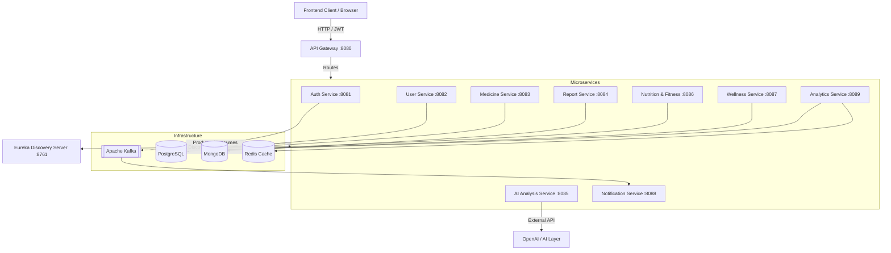

# HealthVerse-AI — Intelligent Healthcare & Wellness Platform

## Project Overview
HealthVerse-AI is a comprehensive, microservices-based platform designed to integrate healthcare management, AI-driven medical analysis, realtime wellness tracking, and fitness planning into a cohesive ecosystem. 

By leveraging a fully distributed Spring Boot microservices architecture, HealthVerse-AI ensures high scalability, fault tolerance, and secure data segregation. AI is integrated to analyze patient medical reports and provide natural-language insights. Real-time healthcare information is processed securely, maintaining patient confidentiality and strict ownership models.

## Architecture

The system follows a classic API Gateway pattern backed by a Service Registry. The frontend communicates exclusively through the secure Gateway, which routes traffic to the appropriate downstream microservice.



## Technology Stack
- **Backend Framework**: Java 17, Spring Boot 3.x
- **Service Discovery**: Netflix Eureka
- **API Gateway**: Spring Cloud Gateway
- **Inter-service Communication**: OpenFeign, Apache Kafka
- **Security**: Spring Security, JWT (Stateless Bearer Tokens)
- **Databases**: PostgreSQL (Relational Data), MongoDB (Document Data - Reports)
- **Caching**: Redis (Analytics Caching)
- **Containerization**: Docker, Docker Compose
- **Build Tool**: Maven

## Microservices Catalog

| Service | Purpose | Port | Database / Infrastructure |
|---------|---------|------|---------------------------|
| `discovery-server` | Service Registry (Eureka) | 8761 | None |
| `api-gateway` | Edge routing, CORS, Security Headers | 8080 | None |
| `auth-service` | User registration, Login, JWT issuing | 8081 | PostgreSQL |
| `user-service` | User profiles, Daily health data metrics | 8082 | PostgreSQL |
| `medicine-service` | Medication tracking and scheduling | 8083 | PostgreSQL |
| `report-service` | Medical report uploads (PDFs) | 8084 | MongoDB |
| `ai-analysis-service`| AI processing of medical data | 8085 | None |
| `nutrition-fitness-service`| Diet plans, fitness regimes | 8086 | PostgreSQL |
| `wellness-service` | Holistic wellness summaries | 8087 | PostgreSQL |
| `notification-service` | Event-driven alerts (Kafka consumer)| 8088 | Kafka |
| `analytics-service` | Real-time health score calculation | 8089 | Redis + PostgreSQL |

## Prerequisites
- **Java 17** (for local development)
- **Docker Desktop** (with Docker Compose)
- **Maven Wrapper** (included in repository)

## Configuration
The project utilizes environment variables to securely manage secrets and infrastructure endpoints. A `.env.example` is provided in the root directory.

**Crucial Variables**:
- `JWT_SECRET`: Must be a secure string >= 256 bits (e.g., `YourSuperSecureSecretKeyForJWTAuthentication2026!`).
- `DB_PASSWORD`: Password for PostgreSQL.
- `CORS_ALLOWED_ORIGINS`: Origins permitted by the API Gateway (e.g., `http://localhost:3000`).
- Infrastructure URIs for Mongo, Redis, and Kafka (pre-configured for Docker).

> [!WARNING]
> Never commit the `.env` file containing real production credentials. Always use `.env.example` as a template.

## Docker Documentation
The entire backend ecosystem is fully containerized.

**Build all images:**
```bash
docker compose build
```

**Start the environment (detached mode):**
```bash
docker compose up -d
```

**Check running containers:**
```bash
docker compose ps
```

**View logs (for all services or a specific service):**
```bash
docker compose logs -f
docker compose logs -f api-gateway
```

**Stop the environment:**
```bash
docker compose down
```

**Rebuild and Restart:**
```bash
docker compose up -d --build
```

*Note: Persistent data for PostgreSQL and MongoDB are managed via Docker volumes. If you need to completely reset the databases, use `docker compose down -v` (Destructive action: deletes all persistent data).*

## API Documentation

All API traffic must be routed through the `api-gateway` on port `8080`. Secure endpoints require an `Authorization: Bearer <token>` header.

### Authentication
- `POST /api/auth/register` - Register a new user (Body: email, password, name, role).
- `POST /api/auth/login` - Authenticate and receive a JWT.

### User & Health Data
- `GET /users/profile` - Retrieve current user's profile.
- `PUT /users/health-profile` - Create/Update user health profile (height, weight, medical conditions).
- `POST /users/daily-data` - Log daily health metrics (steps, sleep, hydration).

### Medicine
- `POST /medicines` - Add a new medication tracking entry.
- `GET /medicines` - List all user medications.

### Reports & AI
- `POST /reports/upload` - Upload a medical report (multipart/form-data).
- `GET /reports` - List uploaded reports.
- `POST /ai/analyze` - Request AI analysis of user health data/reports.

### Nutrition, Fitness & Wellness
- `GET /nutrition` - Get personalized nutrition plans.
- `GET /fitness` - Get fitness routines.
- `GET /wellness/summary` - Aggregate wellness score and summary.

### Notifications & Analytics
- `GET /notifications` - Retrieve recent system notifications.
- `GET /analytics/health-score` - Fetch real-time Redis-cached health analytics.

## Security Overview
HealthVerse-AI implements a robust, defense-in-depth security model:
- **Stateless JWT**: Authentication relies exclusively on cryptographically signed JWTs, eliminating session-hijacking risks and disabling CSRF entirely.
- **IDOR Protection**: All microservices extract the `userId` directly from the validated JWT claims. Users cannot manipulate IDs in request bodies to access unauthorized data.
- **Strict Gateway Actuator**: The gateway does not expose `/actuator/gateway`.
- **Microservice Actuators**: Internal actuators (`/env`, `/heapdump`) are strictly forbidden (403), allowing only `/health` and `/info`.
- **Secure Headers**: The API Gateway injects strict HTTP security headers (`X-Frame-Options`, `X-XSS-Protection`, `X-Content-Type-Options`) onto all API responses.
- **Password Hashing**: Passwords are mathematically hashed via `BCryptPasswordEncoder` prior to PostgreSQL storage.

*Verified: Phase 19 Security Testing -> PASS*

## Testing Documentation
The repository contains comprehensive PowerShell test scripts to validate the entire ecosystem end-to-end.

**1. Phase 18 Integration Testing**
Tests complete business logic flow across all 11 microservices (Registration -> Data creation -> Kafka propagation -> Redis analytics).
```powershell
.\test_phase18.ps1
```
*Verified: 29/29 tests passed.*

**2. Phase 19 Security Testing**
Tests unauthorized actuator access, gateway header injection, and proper HTTP response codes.
```powershell
.\test_phase19_security.ps1
```
*Verified: Security tests passed.*
